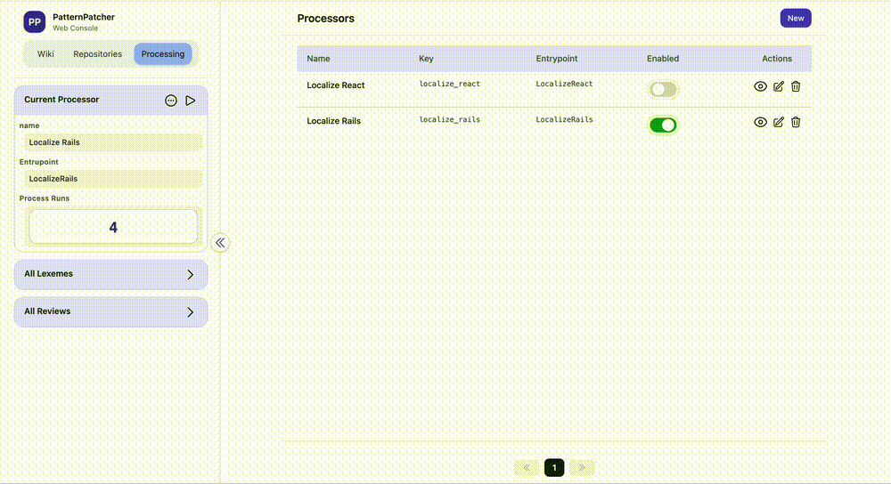

# PatternPatcher

PatternPatcher is an automated code patching system designed for large legacy codebases.  
It enables **reviewable, reversible, precise, file-scoped commits** for batch code modifications.

It is **not** a “one-click code rewriting” tool.  
Instead, it is an **engineering-grade solution that respects Git workflows and human judgment**, making large-scale changes safe in real production repositories.


## Table of Contents

- [Background](#background)
- [Design Goals](#design-goals)
- [Core Capabilities](#core-capabilities)
- [Overall Architecture](#overall-architecture)
- [Core Workflow](#core-workflow)
- [Key Design Decisions](#key-design-decisions)
- [Git Integration Strategy](#git-integration-strategy)
- [Failure and Conflict Handling](#failure-and-conflict-handling)
- [Use Cases](#use-cases)
- [Non-Goals](#non-goals)
- [Current Status](#current-status)
- [Summary](#summary)

## Demo

### review section


## Background

In large legacy codebases, it is common to encounter requirements such as:

- Systematic batch replacement of text, APIs, comments, or i18n keys
- Gradual migration from old code patterns to new ones
- AI- or rule-generated modification suggestions that **cannot be auto-committed**
- Mandatory human review, conflict detection, and incremental application
- Strict adherence to Git commit granularity and readable history

Limitations of traditional approaches:

- Scripts / regex: invisible, unreviewable, irreversible
- One-shot AI rewrites: uncontrollable and extremely risky
- IDE batch replace: no context, no collaboration, no intent tracking

PatternPatcher starts from an engineering conclusion:

> The hard part of large-scale code changes is not *how* to change the code,  
> but *how to ensure every change is understandable, verifiable, and traceable*.

### Why PatternPatcher still matters in the AI era

AI coding tools such as Cursor or MCP are highly effective for small-scale edits, local refactors, and interactive development.  
However, when facing **large repositories, hundreds of files, and tens of thousands of changes**, fundamental engineering limitations remain unavoidable:

- **Reliability**: context truncation and model uncertainty make cross-file batch changes nondeterministic
- **Timeliness**: long inference times and multi-round context passing become uncontrollable at scale
- **Cost**: high token consumption makes whole-repo refactoring economically unsustainable
- **Reviewability**: AI produces *results*, not *individually reviewable change intentions*

In real engineering practice, large-scale code changes **must** eventually be reviewed by humans, confirmed piece by piece, and committed incrementally.

PatternPatcher does not aim to replace AI. Instead, it:

> Bridges AI’s generative power with the engineering world’s need for control, traceability, and commit safety.

It does not ask *“Can we change the code?”*  
It asks:

> *“How can we ensure that every change at scale is still worth committing?”*


## Core Capabilities

### 1. Pattern-Based Repository Scanning (Scan)

The system scans the entire repository using configured patterns (language, file type, regex rules, etc.), producing precise match results.

Each match records:

- File path
- Line number (`line_at`)
- Character range (`line_char_start...line_char_end`)
- Original matched text (`matched_text`)

```text
RepositoryFile
  └── Occurrence
        - line_at
        - line_char_start
        - line_char_end
        - matched_text
```

2. OccurrenceReview: the Smallest Reviewable Patch Unit

Each Occurrence generates an OccurrenceReview, representing one potential code change.

An OccurrenceReview contains:
- Original context
- Rendered new code (rendered_code)
- Review status:
- pending
- approved
- rejected
- Apply status:
- not_applied
- applied
- conflict
- failed

One OccurrenceReview = one minimal modification unit that can be approved or rejected independently.

3. Character-Level Precise Patch Application

PatternPatcher does not rely on diff guessing.
Instead, it validates changes using the exact coordinates recorded during scanning:

lines[line_at - 1][start...end] == matched_text

- Exact match → allowed to apply
- Mismatch → detected as a conflict

This guarantees:
- Manual or external edits are automatically detected
- No silent overwrites
- Deterministic application results

4. Working Tree Writes + Git Index Control

The apply process is strictly layered:
	1.	Modify only the working tree file
	2.	Run:

```bash
git add -- <file>
```


	3.	Only if all OccurrenceReviews for that file are approved
	4.	Run:

```bash
git commit -m "..." -- <file>
```


✔ Each file is committed exactly once
✔ Approval order does not matter
✔ Other staged files are never accidentally committed

## Overall Architecture

```text
Repository
  ├── RepositoryFile
  │     └── Occurrence (scan result)
  │            └── OccurrenceReview (human review)
  │
  ├── ScanRun / Snapshot
  │
  └── GitCli
         ├── git add <file>
         ├── git commit -- <file>
         ├── git diff --cached
         └── git cat-file / ls-tree
```

Key service object:
- ApproveOccurrenceReviewService
- Resource validation
- Patch application
- Conflict detection
- git add
- File-scoped commit
- Fully recoverable error handling

## Core Workflow

Full Flow of a Single Approval

User clicks Approve
  ↓
ApproveOccurrenceReviewService
  1. Validate Occurrence / File / Repository / GitCli
  2. Apply patch with character-level precision
  3. Update review status to approved
  4. git add <file>
  5. If all reviews for the file are approved
        → git commit -- <file>

Every step:
- Explicitly returns success or failure
- Preserves full error context
- Never swallows errors or skips implicitly

## Git Integration Strategy

File-Scoped Commits

Using native Git capabilities:

```bash
git commit -m "message" -- <file_path>
```

This guarantees:
- Even if other files are staged
- The commit includes only the specified file

Disabling Git Hooks for Automation

In real-world projects, repositories often include:
- husky / pre-commit hooks
- eslint / rubocop / stylelint
- environment-dependent checks

Automated commits use:

```bash
git commit --no-verify -- <file>
```

The goal is not to bypass standards, but to:
- Prevent automation from being blocked by local environments
- Preserve developers’ normal commit workflows

## Failure and Conflict Handling

Conflict Detection

When file content differs from the scanned record:
- The file is not written
- apply_status is set to conflict
- A clear error message is returned

Write Failure
- File permission or I/O errors
- Temporary changes are rolled back
- apply_status is set to failed

Git Operation Failure
- Errors from git add or git commit
- Full error output is preserved
- Already-applied files remain unaffected

## Key Design Decisions

Why not use git diff / patch directly?
- Diff describes results, not intent
- Diff can be misapplied when files change concurrently
- Diff cannot reliably express which semantic fragment should be replaced

PatternPatcher instead chooses:

Exact coordinates + original text
as the only trusted source for applying changes.

Why separate Review and Apply?
- Auto-generation ≠ production-ready
- Humans must see:
- Context
- Old vs new code
- Semantic correctness
- Review is a product feature, not an implementation detail

## Use Cases
- Large-scale i18n or copy migrations
- Semi-automated API / SDK upgrades
- Legacy code style → new standards
- AI-generated code that requires human confirmation
- Safe batch modifications in collaborative teams

## Non-Goals

PatternPatcher intentionally does not aim to:
- ❌ Automatically fix all code issues
- ❌ Perform unreviewed one-click rewrites
- ❌ Replace CI, linting, or code review processes

## Current Status
- ✅ Core workflow fully implemented
- ✅ Validated in real large-scale repositories
- ✅ Supports conflict detection, rollback, and file-scoped commits
- 🚧 Potential future extensions:
- Dry-run mode
- Batch approval
- Enhanced review UI
- Pluggable AI patch generators

## Summary

The value of PatternPatcher is not speed, but trust:

It makes large-scale code changes reliable, controllable, and traceable.

It focuses not on technical showmanship, but on
the real complexity and risk management required in production engineering.

## Commercial Use

PatternPatcher is licensed under AGPL-3.0.

Commercial use (including internal enterprise use or SaaS)
requires either full source code disclosure under AGPL or a separate commercial license.

Contact: huangmiao2468@gmail.com