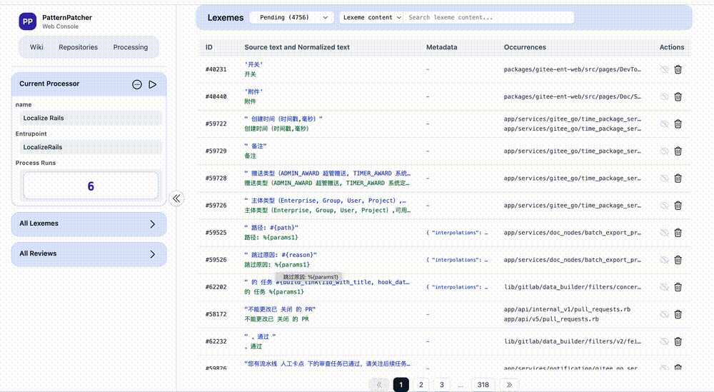

# PatternPatcher

PatternPatcher is an automated code patching system designed for large legacy codebases.  
It enables **reviewable, reversible, precise, file-scoped commits** for batch code modifications.

It is **not** a “one-click code rewriting” tool.  
Instead, it is an **engineering-grade solution that respects Git workflows and human judgment**, making large-scale changes safe in real production repositories.


## Demo

### Run Process


### Review


## Tech Stack

PatternPatcher is built on a modern, production-ready Ruby ecosystem:

| Component  | Version |
|-----------|---------|
| **Ruby**  | ≥ 3.4 |
| **Ruby on Rails** | ≥ 8.0 |
| **PostgreSQL** | ≥ 14.20 |
| **Git** | ≥ 2.50 |
| **Redis** | ≥ 8.4.0 |
| **Sidekiq** | Latest stable |

## Documentation

- 📘 **[Overview](https://github.com/HM2468/pattern-patcher/wiki/Overview)**
- 🗄️ **[Database Design](https://github.com/HM2468/pattern-patcher/wiki/Database-design)**


## How to run

#### clone repository

```bash
git clone https://github.com/HM2468/pattern-patcher.git
cd pattern-patcher
```


#### local run
```bash
# get redis and postgres started
# get ruby 3.4.1 installed
# then
bundle install
yarnpkg install --frozen-lockfile
rails db:create
rails db:migrate
rails db:seed
bin/dev
```

#### docker run
```bash
docker pull ruby:3.4.1-slim-bullseye
docker pull postgres:14.20
docker pull redis:alpine
docker buildx build  -f Dockerfile -t pattern-patcher:rails .
docker compose up -d
```